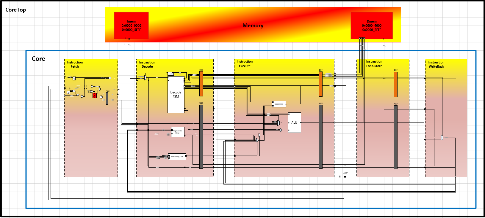

# TaiLung RV32I

Designinig a Pipelined in-order 5 stage RISC-V core RV32I-MF

## Architecture

## Documents
#### [Intro to the project](https://github.com/ChrisShakkour/RV32I-MAF-project/blob/main/doc/proj/TaiLung%20project.pdf)
#### [HAS (high-level architecture specs)](https://github.com/ChrisShakkour/RV32I-MAF-project/blob/main/doc/proj/TaiLung%20HAS%20v1.0.pdf)
#### [MAS (microarchitecture specs)](https://github.com/ChrisShakkour/RV32I-MAF-project/blob/main/doc/proj/TaiLung%20MAS%20v1.3.pdf)
#### [TFM (tools, flows, & methodologies](https://github.com/ChrisShakkour/RV32I-MAF-project/blob/main/doc/proj/TaiLung%20TFM.pdf)
#### [Validation plan](https://github.com/ChrisShakkour/RV32I-MAF-project/blob/main/doc/proj/TaiLung%20validation%20plan.pdf)

## Getting started
#### clone repo
    git clone https://github.com/ChrisShakkour/RV32I-MAF-project.git 

#### cd and source
    cd RV32I-MAF-project
    source source_me.sh

#### Compile RTL design
    compile_hdl -top CoreTop_TB
how to use [compile_hdl]()

#### compile C code
    compile_gcc -src <some c source file> -elf -txt -mem
how to use [compile_gcc]()

#### System-level simulation
    simulate -test <test name>
how to use [simulate]()

#### Example
    git clone https://github.com/ChrisShakkour/RV32I-MAF-project.git
    cd RV32I-MAF-project
    source source_me.sh
    compile_hdl -top CoreTop_TB
    compile_gcc -src verif/tests/TowerOfHanoi/TowerOfHanoi.c -elf -txt -mem
    simulate -test TowerOfHanoi

## References
## What's next?
